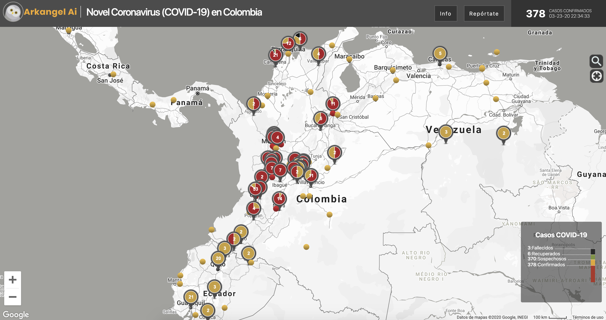
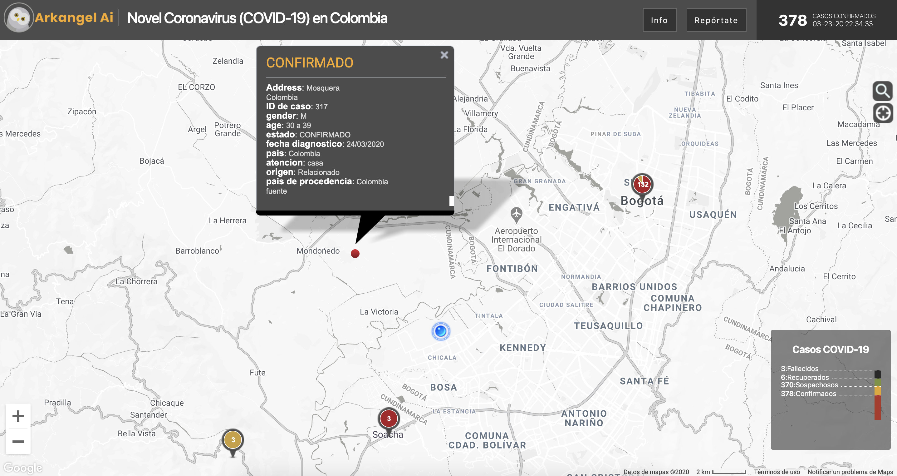
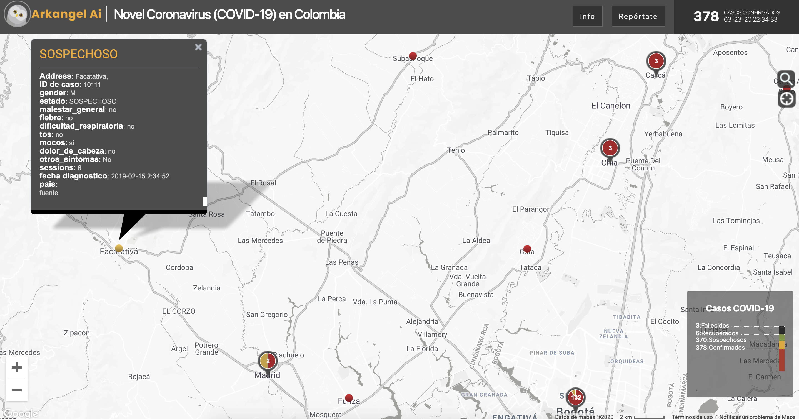
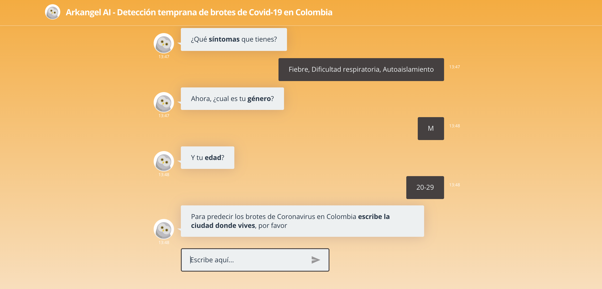

# Early detection of Covid-19 outbreaks in Colombia

## Live demo
* Realtime dashboard: https://www.covid19enlatam.com/  
* Report yourself here: https://www.covid19enlatam.com/reportate.html  

## ScreenShots

Homepage

 
Confirmed

Suspected

 
Report

## Results in one month:
* 79,685 total users reached  
* 9,324 total contributors  
* 12,024 total georeference cases from public and private sources  
* 1 media cover: https://www.publimetro.co/co/noticias/2020/04/02/emprendimientos-colombianos-proposito-la-crisis-coronavirus.html   

## Data Sources:
* World Health Organization (WHO): https://www.who.int/  
* DXY.cn. Pneumonia. 2020. http://3g.dxy.cn/newh5/view/pneumonia.   
* BNO News: https://bnonews.com/index.php/2020/02/the-latest-coronavirus-cases/   
* National Health Commission of the People’s Republic of China (NHC):  
 http://www.nhc.gov.cn/xcs/yqtb/list_gzbd.shtml  
* China CDC (CCDC): http://weekly.chinacdc.cn/news/TrackingtheEpidemic.htm  
* Hong Kong Department of Health: https://www.chp.gov.hk/en/features/102465.html  
* Macau Government: https://www.ssm.gov.mo/portal/  
* Taiwan CDC: https://sites.google.com/cdc.gov.tw/2019ncov/taiwan?authuser=0  
* US CDC: https://www.cdc.gov/coronavirus/2019-ncov/index.html  
* Government of Canada: https://www.canada.ca/en/public-health/services/diseases/coronavirus.html  
* Australia Government Department of Health: https://www.health.gov.au/news/coronavirus-update-at-a-glance  
* European Centre for Disease Prevention and Control (ECDC): https://www.ecdc.europa.eu/en/geographical-distribution-2019-ncov-cases 
* Ministry of Health Singapore (MOH): https://www.moh.gov.sg/covid-19
* Italy Ministry of Health: http://www.salute.gov.it/nuovocoronavirus
* Jhon Hopkins Covid-19 Dashboard: https://github.com/CSSEGISandData/COVID-19
